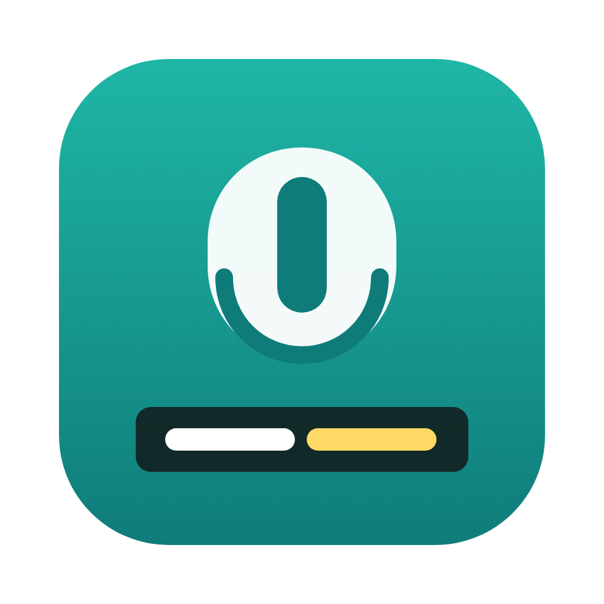

<p align="center">
  
</p>

<h1 align="center">Live Captions</h1>

<p align="center">
  Real-time captions for anything playing on your Mac, translated on the fly. Zoom calls, YouTube, movies, lectures.
</p>

<p align="center">
  <a href="https://github.com/Dunebru/livecaptions/releases/latest"></a>
  <a href="https://github.com/Dunebru/livecaptions/releases"></a>
  
  
  <a href="LICENSE"></a>
</p>

<p align="center">
  <a href="https://github.com/Dunebru/livecaptions/releases/latest"></a>
</p>

macOS has Live Captions built in, but it cannot translate. Zoom, Otter and the like charge $17 to $20 a month for captions that go through their servers. This app listens to your Mac's audio (or the microphone), runs NVIDIA's Parakeet streaming recognizer on the Neural Engine, and translates each sentence with Apple's on-device Translation framework. Nothing leaves the machine.

<details>
<summary>Table of contents</summary>

- [Features](#features)
- [Install](#install)
- [Usage](#usage)
- [FAQ](#faq)
- [Build from source](#build-from-source)
- [License](#license)
- [Acknowledgements](#acknowledgements)

</details>

## Features

- **Captions any audio**: whatever is playing on the Mac (via ScreenCaptureKit, no virtual audio driver) or the microphone
- **Translation as you go**: each finished sentence is translated to one of 20 languages with Apple's Translation framework (macOS 15+). Show the original, the translation, or both
- **Floating overlay**: always on top, works over full-screen apps, drag it anywhere, resize it, make it click-through
- **Streaming recognizer**: about a second of latency, words appear as they are spoken
- **Transcript window** with copy, for notes after a meeting or lecture
- **Menu bar app**, no Dock icon, one click to start and stop
- **Private**: the model downloads once, then no network is used except Apple's language packs the first time you pick a language

## Install

Download **LiveCaptions.zip** from the [latest release](https://github.com/Dunebru/livecaptions/releases/latest), unzip, move **Live Captions.app** to Applications.

Unsigned app: first launch is **right-click → Open → Open**. If macOS still refuses:

```bash
xattr -dr com.apple.quarantine "/Applications/LiveCaptions.app"
```

Requires macOS 14 Sonoma or newer on Apple silicon. Translation needs macOS 15.

### Permissions

- **Screen Recording** is how macOS lets an app hear system audio. Live Captions requests a 2x2 pixel video stream and discards every frame; only the audio is used. Grant it in System Settings → Privacy & Security → Screen & System Audio Recording.
- **Microphone**, only if you choose the microphone source.

## Usage

1. Click the caption icon in the menu bar.
2. Pick **System audio** or **Microphone**, and a language to translate to (or Off).
3. Press **Start Captions**. The overlay appears at the bottom of the screen; drag it wherever you like.
4. **Transcript…** opens everything captioned this session, with a Copy button.

## FAQ

**Which languages does it recognize?**
The streaming model is English-first. Multilingual streaming is on the list; the [Subtitles](https://github.com/Dunebru/subtitles) app handles 25 languages for recorded files today.

**How accurate is it?**
Parakeet's streaming variant is within a point or two of its offline word error rate, which is on par with Whisper large. Music and crosstalk hurt it like any recognizer.

**Does it work in full-screen video?**
Yes, the overlay joins every Space and floats above full-screen windows.

**Why does it need Screen Recording?**
Apple only exposes system audio to apps through ScreenCaptureKit. There is no audio-only permission. No video is stored or shown.

## Build from source

```bash
git clone https://github.com/Dunebru/livecaptions.git && cd livecaptions
swift test
scripts/build-app.sh      # dist/LiveCaptions.app and dist/LiveCaptions.zip
```

Live Captions is a Swift package with one dependency, [FluidAudio](https://github.com/FluidInference/FluidAudio) (Apache 2.0), vendored under `Vendor/`.

## License

[MIT](LICENSE) © dunebru

## Acknowledgements

- [Parakeet](https://huggingface.co/nvidia) by NVIDIA, CC BY 4.0
- [FluidAudio](https://github.com/FluidInference/FluidAudio) for the CoreML streaming port
